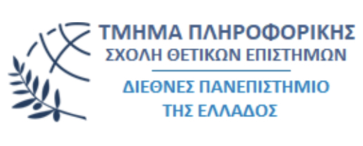

# embeddedsystems

# ΟΜΑΔΑ:

Πασχάλης Ηλίας- Επαμεινώνδας

Ραλούσης Αναστάσιος

Γιερμαντζής Ευστράτιος- Φανούριος	

# Περιγραφή project:

Δημιουργία line follower με την χρήση του Maker Pi RP2040

# Εξαρτήματα:

Maker Pi RP2040 board

Robotics Kit

x2 IR sensors
